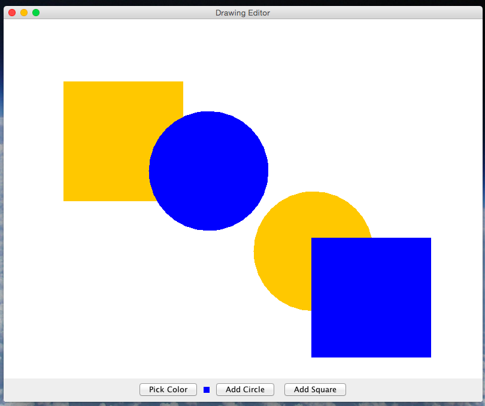
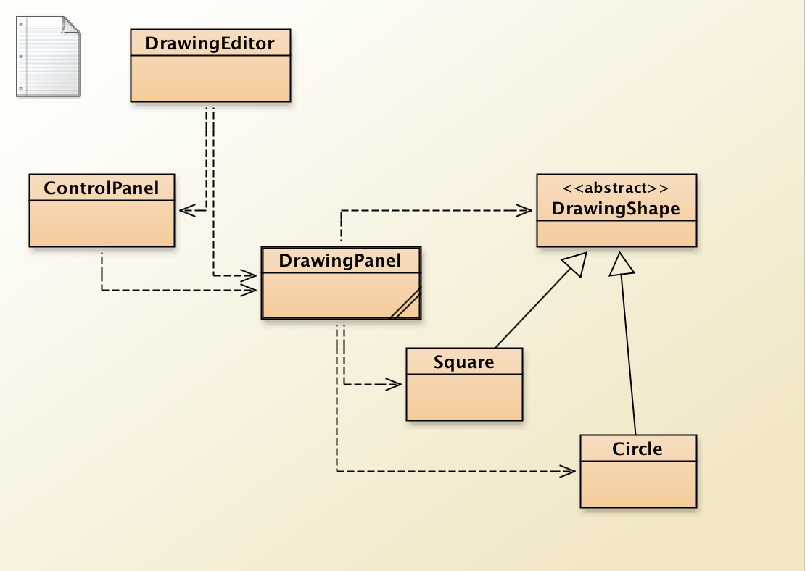

Drawing Editor Lab

Heavily based on "18.6 Case Study and Lab: Drawing Editor" from *Java Methods* by Litvin & Litvin.

# Introduction

In this lab we will create a Drawing Editor* *program in which the user can add several filled shapes of different colors and sizes to the picture and drag (*extension: and stretch or squeeze*) them with the mouse (*extension: or cursor keys*). Figure 1 shows a snapshot from the program. The program’s control panel has three buttons: one for choosing a color, another for adding a "circle" to the picture, and a third for adding a “square” to the picture. A small panel displays the currently selected color.

*Figure 1. The DrawingEditor program*

The user can "grab" any shape by clicking on it. The grabbed shape changes from a solid (filled) shape to the outline only. If the user grabs the shape somewhere inside it, then she can drag it with the mouse to a new location (while its size remains unchanged). When another shape is grabbed or the mouse is clicked elsewhere in the canvas, the shape goes back to its solid shape.

					

*Extension: If she grabs the shape in the vicinity of its border, then she can stretch or squeeze the shape while its center remains in the same location. *

*Extension: The last shape added or "grabbed" becomes the “active” shape. The user can move it using cursor (arrow) keys and stretch or squeeze it using the cursor keys with the **Shift** **key held down. *

The program consists of six classes (Figure 2). DrawingEditor (derived from JFrame) represents the program window; ControlPanel (derived from JPanel) represents the panel that holds the buttons; DrawingPanel (derived from JPanel) represents the canvas on which shapes are drawn, and Circle and Square (both derived from DrawingShape) represents shape objects.

					

*Figure 2. Classes in DrawingEditor*

					

Our *Drawing Editor *program uses a JColorChooser for choosing a color. The static showDialog method is particularly useful.

# Requirements

* All classes (including instance variables and methods) must be documented using JavaDoc-style comments.

## DrawingEditor

Most of the DrawingEditor class is implemented in the starter code in the GitHub repository. The DrawingEditor class extends JFrame. The DrawingEditor’s constructor displays "Drawing Editor" in the title bar. It creates a DrawingPanel canvas and a ControlPanel controls and passes canvas to the ControlPanel’s constructor as a parameter (so that controls knows what it controls). Attach canvas and controls to the appropriate regions of the JFrame’s content pane (read about the BorderLayout class for specifics). The DrawingEditor class provides a standard main method that creates a new DrawingEditor object which opens a window on the screen.

## ControlPanel

ControlPanel extends JPanel. Add three buttons to it: "Pick Color," “Add Circle,” and “Add Square.” Add a JPanel after the “Pick Color” button; its purpose is to show the currently selected color. Call canvas’s getColor method to obtain the initial color. Attach the appropriate listener to the “Pick Color,” “Add Circle,” and “Add Square” buttons, using the control panel itself as a listener, or, if you prefer, inner action listener classes, or anonymous inline classes. When “Pick Color” is clicked, call canvas’s pickColor method, then get the selected color back from canvas and show that color on the color display button. When “Add Circle” or “Add Square” is clicked, call canvas’s addCircle or addSquare method. *Extension: Don’t forget to return the keyboard focus to **canvas** **in either event (read about **JComponent**’s **requestFocusInWindow** method).*

*Extension: Support more sophisticated creation of shapes where the user clicks the button for the desired shape and then clicks and drags to specify both where the shape should be centered and what size it should be.*

## DrawingShape

This abstract class implements a shape with a given center, radius (technically, the apothem), and color. Its constructor and methods are summarized in Table 2.

Thoroughly test all the mouse and keyboard action in your program.

		 			

<table>
  <tr>
    <td>Constructor:		
DrawingShape(Point2D.Double center,
    double radius, Color color)		</td>
    <td>Creates a shape with the center at the specified point and with the specified radius and color.		</td>
  </tr>
  <tr>
    <td>Methods:				</td>
    <td></td>
  </tr>
  <tr>
    <td>Point2D.Double getCenter()			</td>
    <td>Returns the the center of the shape.</td>
  </tr>
  <tr>
    <td>double getRadius()			</td>
    <td>Returns the radius.			</td>
  </tr>
  <tr>
    <td>Color getColor()</td>
    <td>Returns the color.</td>
  </tr>
  <tr>
    <td>void move(double x, double y)	</td>
    <td>Sets the center of the shape to the specified x and y values.

Extension: For the smooth dragging extension, the definition of this method is that it displaces the center of this shape by (x, y). The specified x and y values are by how much to change the center position. That is, they are the change in position and, therefore, can be positive or negative.</td>
  </tr>
  <tr>
    <td>void setRadius(double r)			</td>
    <td>Sets the radius of this shape to r.	</td>
  </tr>
  <tr>
    <td>boolean isInside(Point2D.Double point)	</td>
    <td>Returns true if the point lies inside this shape, false otherwise. (Abstract in DrawingShape class.)</td>
  </tr>
  <tr>
    <td>boolean isOnBorder(Point2D.Double point)				</td>
    <td>Extension: Returns true if the point lies approximately on the border of this shape, false otherwise. (Abstract in DrawingShape class.)</td>
  </tr>
  <tr>
    <td>void draw(Graphics2D g2, boolean filled)		</td>
    <td>Draws this shape. Draws a filled shape if filled is true, and a hollow shape otherwise. (Abstract in DrawingShape class.)</td>
  </tr>
</table>

*Table 2. The constructor and public methods of the abstract **Drawing**Shape** **class*

## Circle and Square

The Circle and Square classes are derived from the abstract DrawingShape base class and draw their respective shapes.

## *Extension: add additional types of shapes.*

## DrawingPanel

This is where most of the work is done. This class is a subclass of JPanel. It can implement the MouseListener and MouseMotionListener interfaces *(extension: and **KeyListener**)* itself, or, if you prefer, inner classes, or anonymous inline classes can instead. In the DrawingPanel constructor, be sure to add whichever listener you have to this panel as these listeners.

A DrawingPanel maintains a list of shapes (an ArrayList<DrawingShape>) and a reference to the "active shape." The latter refers to the last added shape or the shape last picked with a mouse (a shape is “picked” when the mouse clicks inside of it or on its border). DrawingPanel should also have an enum field or boolean field that indicates whether a shape is currently picked.

*Extension: If a shape is currently picked and stretching is supported, the** **enum** **field or additional **boolean** **field is needed to determine if the shape** is being moved or stretched.*

DrawingPanel’s constructor and some of the methods are summarized in Table 1. The methods that implement the requirements of the MouseListener, MouseMotionListener, and KeyListener interfaces are not shown. Of these only mousePressed, mouseDragged, and keyPressed are used.

<table>
  <tr>
    <td>Constructor:
DrawingPanel()			</td>
    <td>Sets the background color to white and the initial drawing color to a color of your choice. Adds this as the MouseListener, MouseMotionListener, and KeyListener.
Creates an empty shapes list.		</td>
  </tr>
  <tr>
    <td>Methods:</td>
    <td>				</td>
  </tr>
  <tr>
    <td>Color getColor()				</td>
    <td>Returns the current drawing color.</td>
  </tr>
  <tr>
    <td>Dimension getPreferredSize()</td>
    <td>Overrides JCompoent’s getPreferredSize method to return a size large enough to encapsulate a reasonable drawing canvas.</td>
  </tr>
  <tr>
    <td>void pickColor()</td>
    <td>Called from ControlPanel when the "Pick Color" button is clicked. Brings up a JColorChooser and sets the chosen color as the new drawing color. Leaves the drawing color unchanged if the user clicks “Cancel.”</td>
  </tr>
  <tr>
    <td>void addCircle()</td>
    <td>Called from ControlPanel when the "Add Circle" button is clicked. Adds a new circle to the list. The new circle has its center at the center of the drawing panel, a random radius (within a reasonable range) and the current drawing color. The new circle is designated as the “active shape.”</td>
  </tr>
  <tr>
    <td>void addSquare()</td>
    <td>Called from ControlPanel when the "Add Square" button is clicked. Adds a new square to the list. The new square has its center at the center of the drawing panel, a random radius (within a reasonable range) and the current drawing color. The new square is designated as the “active shape.”</td>
  </tr>
  <tr>
    <td>void paintComponent(Graphics g)	</td>
    <td>Draws all the shapes in the list. The shapes should be drawn such that the most recently created shape is drawn “on top”. However, if one of the shapes is “picked,” then this “active shape” should be drawn last, in outline only. First call the superclass version of paintComponent to draw the background of the panel.		</td>
  </tr>
</table>

*Table 1. The constructor and methods of the **DrawingPanel **class (except the listener methods)*

When the mouse is pressed on shapes, make sure you pick the topmost shape that contains the coordinates of the click. If you add shapes at the end of the list, then you need to scan the list from the end backward to achieve that.

*Extension: While dragging a shape is required, smooth dragging (not snapping the shape to the mouse location) is an extension. The secret for smooth dragging action is to keep constant the x-y offsets from the current mouse position to the current shape’s center as the mouse moves. Save the previous mouse position while dragging such that these offsets remain the same as the shape is moved. Otherwise the center or corner of the shape will "snap" to the mouse location when dragged.*

*Extension: If the initial click happens in the vicinity of the border of a shape (that is, **isOnBorder(x, y)** **returns **true**), then instead of dragging the shape make the mouse motion stretch or squeeze it. You need a **boolean** **field (or enum) in **DrawingPanel** **to mark whether you will be moving or stretching the picked shape. The same principle as for moving applies for smooth stretching action, but is a little more complicated.*

*Extension: Enable cursor keys to move the active shape (if not **null**) or to stretch or squeeze it when the **Shift** **key is held down.*

Don’t forget to call repaint after adding a shape and whenever one of the listener methods changes the appearance of the picture.

# Extensions

* Support resizing the shapes by clicking near the edge of the shape and dragging to change the size

* Support fine-grained moving of shapes by using the arrow keys to move the active shape

* Support fine-grained re-sizing of shapes by using the arrow keys with the shift key held down to resize the active shape

* Support more than two types of shapes.

* Support more sophisticated creation of shapes where the user clicks the button for the desired shape and then clicks and drags to specify both where the shape should be centered and what size it should be.

* Add more awesome.

# Submission

* Submit a link to your GitHub repository with this assignment.

https://docs.google.com/document/d/16M193ZTWxfMHaiuG3mIN91wZUczewUyenMBBf5IBn84/edit#heading=h.dp6yvn3xbr02
